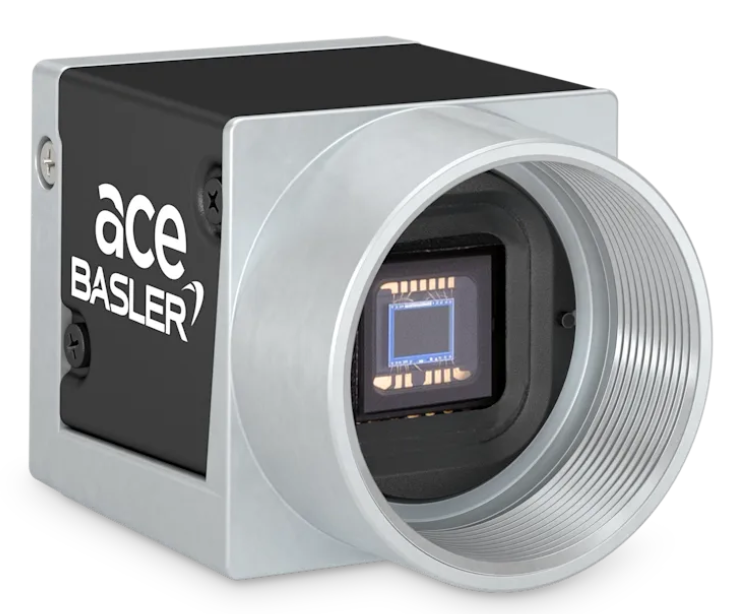
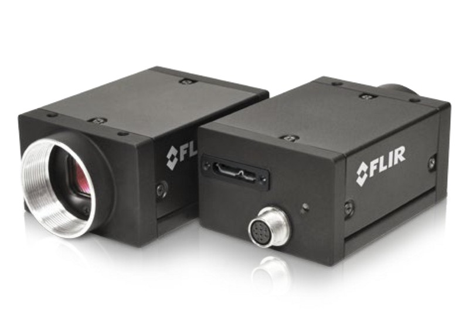

# Hardware and Software Triggered Synchronous Data Acquisition with Basler and FLIR Cameras

## Features

- <span style="color: green;">✔️</span> **Multi-camera support** – Works with Basler acA2040-120um and FLIR Grasshopper-3 USB-3.
- <span style="color: green;">✔️</span> **Software & hardware triggering** – Trigger cameras via software or Arduino-generated PWM signals.
- <span style="color: green;">✔️</span> **Real-time streaming** – Live preview with adjustable camera settings.
- <span style="color: green;">✔️</span> **Machine learning integration** – Run inference from pretrained ML models directly on camera streams.
- <span style="color: green;">✔️</span> **Data recording** – Save frames as videos with frame-by-frame metadata.
- <span style="color: green;">✔️</span> **Parallel processing** – Uses Python threading to keep acquisition, display, and processing non-blocking.
- <span style="color: green;">✔️</span> **Stimulation control** – Synchronize LED stimulation with hardware triggers.
- <span style="color: green;">✔️</span> **Configurable acquisition** – Flexible YAML/JSON configs for camera usage, preview options, and frame rates.

<p align="center">
  
  
  
</p>

This software live streams the frames of Basler acA2040-120um and FLIR Grasshopper-3 USB-3 cameras with additional functionalities such as configuring the camera settings, exporting frames as a video, saving metadata of each frame, triggering camera from software (SW) or hardware (HW) by generating a PWM from Arduino's digital output pin, making inference from a pretrained ML model, preview of the camera stream and model predictions.

The software utilizes concurrency capabilities (i.e., threading) of Python to run tasks parallelly without blocking each other.

# Installation

## Software

1. **For Basler**: Download and install [Basler Pylon SDK](https://www2.baslerweb.com/en/downloads/software-downloads/#type=pylonsoftware).
2. **For FLIR**: Download and install [FLIR Spinnaker SDK 4.0.0 (both GUI and Python SDK)](https://www.teledynevisionsolutions.com/support/support-center/software-firmware-downloads/iis/spinnaker-sdk-download/spinnaker-sdk--download-files/?pn=Spinnaker+SDK&vn=Spinnaker+SDK). Make sure the correct FFMPEG dependencies exist and SpinView can recognize the camera. I used [FFMPEG-4.4.5 "Rao"](https://www.ffmpeg.org/download.html#releases).

2. **[Optional for hardware trigger with Arduino]** Compile and upload [utils/arduino_pwm_led/arduino_pwm_led.ino](utils/arduino_pwm_led/arduino_pwm_led.ino) file to the Arduino.

## Hardware

1. Connect Basler USB 3.0 and/or FLIR GS3-U3 to the computer.

**(Optional) Steps for hardware trigger via PWM from Arduino**:

<p align="center">
  
</p>

Replace the buzzer in the circuit with the camera of your choice (Basler or FLIR or both), and think of pink cable as your GPIO trigger line, and black is the GND. LED connection is only provided for stimulation. If no stimulation is needed, it can be ignored.

2. Connect:
    - Pin 3 of Arduino with Pin 1 (Brown cable) of the Basler, and Pin 4 (Green cable) of the FLIR GS3-U3.
    - GND pin of Arduino with Pin 6 (White cable) of the Basler, and Pin 5 (Brown cable) of the FLIR GS3-U3.

3. Connect Pin 10 of Arduino with the stimulation's input ((+) for the external LED) line, and GND pin of Arduino with LED's (-) line.

4. Connect Arduino to the computer via USB.

5. Set Arduino access rights (if using Arduino for the first time on Linux):

    ```bash
    # navigate to rules.d directory
    cd /etc/udev/rules.d
    #create a new rule file
    sudo touch my-newrule.rules
    # open the file
    sudo nano my-newrule.rules
    # add the following
    KERNEL=="ttyACM0", MODE="0666"
    ```
    Restart the computer for the access rights to take effect.

## Dependencies

You can create a new environment before installing the necessary dependencies.

```bash
conda create -n <your_env_name> python=3.10
conda activate <your_env_name>
```

Intall the dependencies via:

```bash
cd <project_folder>
pip install -r requirements.txt
```

If some packages do not get installed, install them separately via:

`pip install <package_name>`

## Configs
[config/config-basler_multi_cam.yaml](config/config-basler_multi_cam.yaml) is the only up-to-date config file.

**Selecting Camera and Previews:** Each camera in the configuration file has a unique name (i.e., basler_0) and the following attributes:

```yaml
use: True # using the camera or not
preview: True # show preview of live stream
predict: False # make real-time ML model inference
preview_predict: False # preview ML model inferences on the live frame
pred_preview_toggle_button: 'b' # toggle button for prediction preview
```

Currently, both cameras can be used but only one preview should be enabled. 

**Recording Duration:** `--n_total_frames` argument in the main script ([acquire_multi_cam.py](acquire_multi_cam.py)) and `recording_fps` in [stimulation_config.json](config/stimulation_config.json) defines the recording duration.

**Data Save Path:** `savedir` under the [configuration file](config/config-basler_multi_cam.yaml) file controls the data storing path.
`-s` argument enables or disables data saving.

**Acquisition Mode:** `--acquisition_mode` controls the acquisition mode, and is only implemented for `"frames"` for now.

**SW vs. HW Trigger:** The cameras can be trigger via both SW or HW (Arduino). The relevant `--config` file should be provided for either case. For the HW trigger, `--trigger_with_arduino` should be set to one of the followings `['true', '1', 't', 'y', 'yes']`

- **For HW trigger:** With two cameras (Basler + GS3-U3), we can acquire data at 60 FPS with (1280 x 1280) resolution or one camera with 120 FPS with the same resolution.

- **For SW trigger:** We can acquire data at 120 FPS with (1280 x 1280) resolution regardless of one or two cameras.

`AcquisitionFrameRateEnable` should be `False` for the HW trigger, and `True` for the SW trigger in Basler options, but this case is handled in [basler.py](utils/basler.py) in the `update_settings()` method.

**(Optional) External Stimulation (e.g., LED):** Stimulation can only be used in the HW trigger mode.

- If `--stimulation_path` is empty (i.e., `""`), no led stimulation will be triggered. [stimulation_config.json](config/stimulation_config.json) contains the stimulation profiles with the following structure:
    ```json
    "<block number>": {"duration_sec": "8", // duration of the block in sec
                        "stimulation": "1", // bool flag for whether stimulation exists
                        "stimulation_turnOn_times_sec": ["2", "4"], // list of local (within block) stimulation start times in sec
                        "stimulation_durations_ms": ["1000", "2000"], // list of stimulation durations in ms
                        "pulse_ontime_ms": ["50", "250"], // list of pulse on times in ms
                        "pulse_offtime_ms": ["50", "250"]}, // list of pulse off times in ms
    ```

- `--n_total_frames` should be equal to the product of total duration of each blocks in [stimulation_config.json](config/stimulation_config.json) and the `AcquisitionFrameRate` parameter in the [camera config file](config/config-basler_multi_cam.yaml).

# Running

You can run the main program [acquire_multi_cam.py](acquire_multi_cam.py) via:

```bash
python acquire_multi_cam.py
```

Or with appropriate attribute changes. To see the list of available options:

```bash
python acquire_multi_cam.py -h
```

# Troubleshooting
## 1. Hardware

- ### Camera

    For GPIO coax cable color codes, refer [here](https://docs.baslerweb.com/basler-io-cable-hrs-6p-open-p?_gl=1*6p8gh3*_gcl_au*MTQyMTg2MzkwOC4xNzI2MDg5ODQ4).

    Find Basler GPIO pins [here](https://docs.baslerweb.com/aca2040-120um)

- ### Arduino

    If the Arduino IDE stalls with the following notification:

    `Downloading index library_index.tar.bz2`

    First, make sure the serial monitor is closed. If it doesn't solve the problem, end arduino processes in the system monitor or kill their pids, and delete `/home/<username>/.arduinoIDE/arduino-cli.yaml` file.

## 2. Software

- ### Spinnaker

    I needed to make a static build for the FFMPEG by following the commands:

    ```bash
    # Navigate to the downloaded folder
    cd ~/Downloads/ffmpeg-4.4.5

    # Configure FFmpeg with Shared Libraries: Rebuild FFmpeg, enabling shared libraries
    ./configure --enable-shared --disable-static --enable-gpl --disable-x86asm

    # Compile and Install
    make -j$(nproc)
    sudo make install

    # make sure the .so files are present
    ls /usr/local/lib | grep libav

    # update library cache
    sudo ldconfig
    ```

    For the following error in SpinView:

    ```
    Spinnaker system instance cannot be acquired. could not load producer.make sure the environemnt variable SPINNAKEr_gentl64_cti exists, and points to the location of the file spinnaker_gentl.cti [-1012]
    ```

    Set the environment variables:

    ```bash
    sudo nano ~/.bashrc
    export SPINNAKER_GENTL64_CTI=/opt/spinnaker/lib/spinnaker-gentl/Spinnaker_GenTL.cti
    export LD_LIBRARY_PATH=/opt/spinnaker/lib:$LD_LIBRARY_PATH
    ```
    Then reboot. Make sure SpinView runs and recognizes the camera. 
